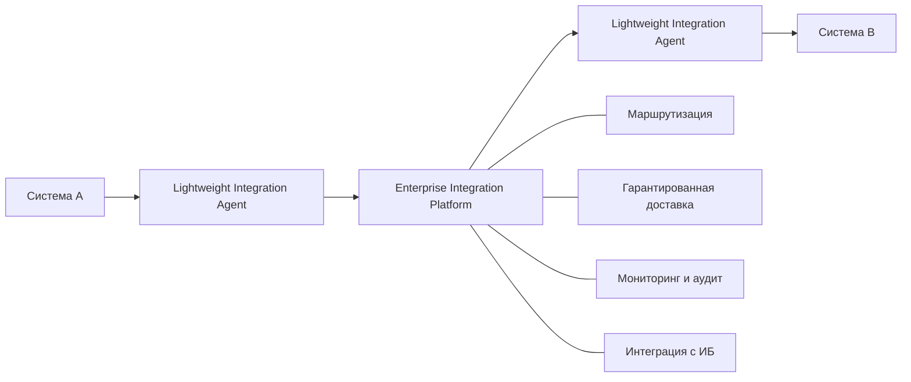

# Модернизация корпоративной интеграции

**Миграция с унаследованной транспортной платформы — архитектурный кейс**

[English version](README.en.md)

> Синтетический архитектурный кейс, основанный на практическом опыте масштабной модернизации распределенного интеграционного ландшафта.

## Кратко о кейсе

Крупная географически распределенная организация накопила портфель критичных интеграций, реализованных через унаследованную транспортную платформу. Ландшафт включает прикладные агенты рядом с бизнес-системами, региональные транспортные узлы, централизованную маршрутизацию, разделяемые транспортные компоненты, разные требования информационной безопасности и независимые окна изменений у владельцев систем.

Задача — не просто заменить брокер сообщений. Архитектурная проблема состоит в том, чтобы вывести унаследованную транспортную платформу из эксплуатации без единовременного отключения всех интеграций, сохранив непрерывность бизнес-процессов и минимизировав изменения прикладных систем.

Кейс показывает подход, основанный на:

- архитектуре AS-IS, переходной и целевой архитектуре;
- поэтапной миграции вместо единовременного переключения;
- типовых сценариях миграции для повторяемого принятия решений;
- временном сосуществовании старой и новой платформ;
- критериях готовности и планировании волн миграции;
- пилоте перед масштабированием миграции;
- контролируемых переключении, проверке и откате;
- архитектурно управляемом взаимодействии платформенной команды, эксплуатации, владельцев приложений, инфраструктуры и ИБ.

## Моя роль

**Архитектор интеграционных решений / Technical Lead — направление миграции**

В кейсе отражены следующие зоны ответственности:

- архитектура направления миграции унаследованных интеграций;
- анализ и типизация существующих взаимодействий;
- определение типовых сценариев миграции и переходных состояний;
- планирование последовательности миграции;
- архитектурная поддержка переключения и отката;
- координация технических участников;
- участие в общей архитектуре целевой интеграционной платформы.

Архитектура платформы в целом была командной работой. В этом публичном кейсе сознательно сделан акцент на направлении миграции, где моя ответственность была максимальной.

## Архитектурная задача

Исходный ландшафт содержит:

- прикладные агенты, установленные рядом с бизнес-системами;
- региональные и центральные транспортные компоненты;
- общие унаследованные endpoint-компоненты, используемые несколькими взаимодействиями;
- локальную обработку, исторически встроенную в транспортные конфигурации;
- стандартные и повышенные требования безопасности;
- фактические конфигурации, которые могут отличаться от документации;
- независимые окна сопровождения приложений.

Следовательно, миграция должна позволять системам переходить в разное время, а при необходимости — временно поддерживать одновременно старый и новый интеграционные пути.

## Цель архитектуры

Спроектировать модель миграции, которая:

1. позволяет приложениям мигрировать независимо;
2. минимизирует изменения приложений там, где это обоснованно;
3. поддерживает временное сосуществование унаследованной и целевой платформ;
4. отделяет стандартную миграцию от случаев, требующих доработки приложений;
5. задает однозначные процедуры переключения и отката;
6. масштабируется от пилота до повторяемого процесса массовой миграции.

## Архитектура в трех состояниях

### AS-IS

### Переходная архитектура

### Целевая архитектура

Ключевой тезис: **миграция — это задача трансформации портфеля интеграций, а не последовательная замена инфраструктурных компонентов**.

## Типовые сценарии миграции

| ID | Сценарий | Когда применяется |
|---|---|---|
| M1 | Direct Migration | Обе стороны можно переключить в одном окне и отсутствует логика, специфичная для старой платформы |
| M2 | Hybrid Coexistence | Участников нельзя мигрировать одновременно или они используют общие унаследованные компоненты |
| M3 | Security-Constrained Migration | Требуются дополнительные операции с учетными данными, сертификатами, ключами или проверками ИБ |
| M4 | Application Remediation | Старая транспортная платформа выполняет функции, которые нельзя прозрачно заменить без изменения приложения или интеграционного решения |

Подробнее: [Стратегия миграции](docs/migration-strategy.md).

## Жизненный цикл миграции

## Сложность и готовность — разные измерения

Технически сложная интеграция может быть полностью готова к миграции. Простая интеграция может быть заблокирована отсутствием владельца, доступов, тестовых данных или согласованного окна изменений.

**Сложность:** LOW / MEDIUM / HIGH  
**Готовность:** READY / CONDITIONAL / BLOCKED

Это разделение позволяет не сводить приоритизацию к одному условному баллу.

## Планирование волн

| Этап | Назначение |
|---|---|
| Pilot | Проверка процедуры, отката и модели оценки трудоемкости |
| Wave 1 | Независимые взаимодействия с низким риском |
| Wave 2 | Контролируемая сложность и дополнительные предварительные условия |
| Wave 3 | Гибридные сценарии, разделяемые зависимости и критичные взаимодействия |
| Wave 4 | Доработка приложений и нестандартных интеграционных решений |

Номер волны не вычисляется автоматически из технической сложности. Он является результатом архитектурной и организационной оценки готовности, зависимостей, риска и ценности миграции.

## Навигация по репозиторию

| Раздел | Содержание |
|---|---|
| [Архитектурные диаграммы](architecture/) | Исходники ключевых представлений: AS-IS, transition, target, decision tree, migration factory и rollback |
| [Context & Drivers](docs/context-and-drivers.md) | Проблема, ограничения и архитектурные драйверы |
| [Architecture](docs/architecture.md) | AS-IS, переходное и целевое состояния |
| [Migration Strategy](docs/migration-strategy.md) | Типовые сценарии, дерево решений и жизненный цикл |
| [Migration Factory](docs/migration-factory.md) | Оценка портфеля, готовность и планирование волн |
| [Risk & Governance](docs/risk-and-governance.md) | Риски, контрольные точки переключения, RACI |
| [Lessons Learned](docs/lessons-learned.md) | Обобщенные архитектурные выводы |
| [Architecture Decisions](decisions/) | ADR по ключевым решениям трансформации |
| [Synthetic Data](data/) | Вымышленный реестр интеграций и пример планирования |
| [Governance](governance/) | Checklist готовности, реестр рисков и модель ответственности |

## Ключевые архитектурные решения

- [ADR-001 — поэтапная миграция вместо Big Bang](decisions/ADR-001-incremental-migration.md)
- [ADR-002 — временное гибридное сосуществование](decisions/ADR-002-hybrid-coexistence.md)
- [ADR-003 — сохранение контрактов приложений там, где это оправданно](decisions/ADR-003-preserve-application-contracts.md)
- [ADR-004 — пилот перед масштабированием миграции](decisions/ADR-004-pilot-first.md)

## Что демонстрирует кейс

Кейс показывает, как:

- преобразовать неоднородный унаследованный интеграционный ландшафт в классифицированный портфель миграции;
- определить явные переходные состояния вместо прямого скачка от AS-IS к TO-BE;
- отделить стандартную миграцию от работ по доработке приложений;
- использовать критерии готовности до планирования производственного переключения;
- поддерживать временное сосуществование двух платформ, не превращая переходное решение в постоянное;
- рассматривать откат как часть архитектуры миграции, а не как эксплуатационную импровизацию;
- использовать пилот для проверки подхода и модели оценки до масштабирования миграции;
- организовать повторяемый процесс, пригодный для большого портфеля интеграций.

## Дисклеймер

**Репозиторий содержит только синтетические и анонимизированные материалы портфолио.**

Все организации, названия систем, топология, данные, показатели, диаграммы, примеры и эксплуатационные сценарии созданы специально для этого кейса. В репозитории отсутствуют корпоративные документы, исходный код работодателя, конфигурации, учетные данные, сетевые параметры и внутренние инструкции. Кейс отражает обобщенный профессиональный опыт и не воспроизводит реализацию конкретной организации.
