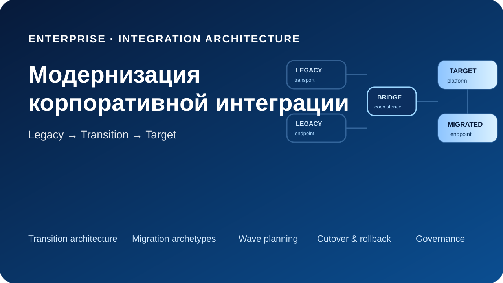
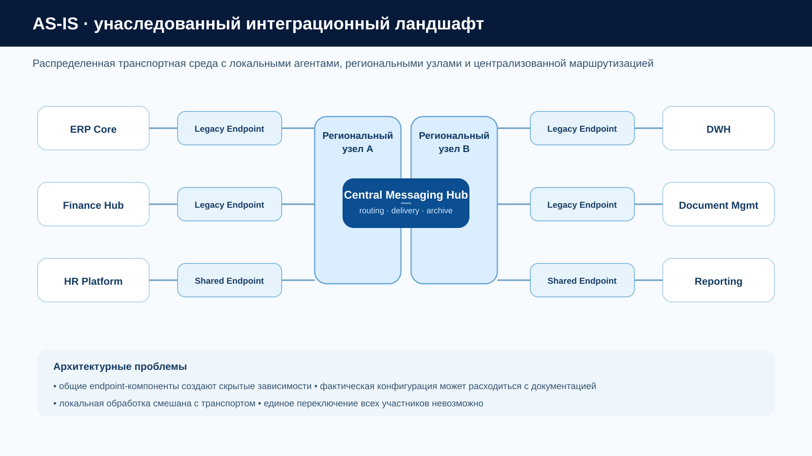
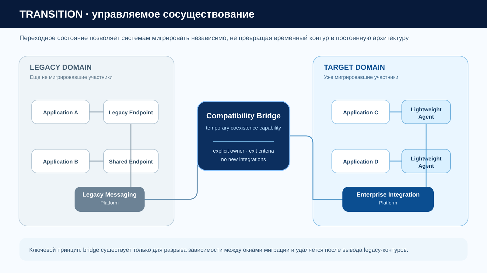
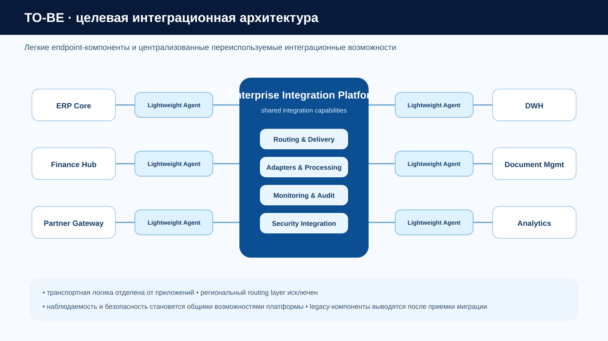
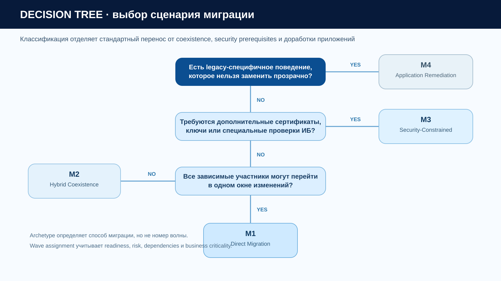
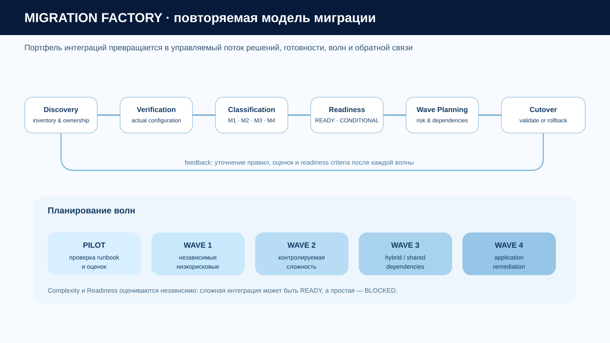
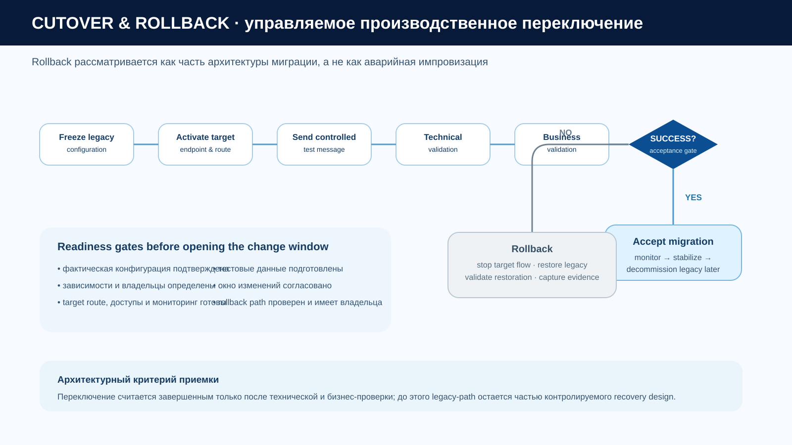

# Модернизация корпоративной интеграции

**Миграция с унаследованной транспортной платформы — архитектурный кейс**

[English version](README.en.md)

> Синтетический архитектурный кейс, основанный на практическом опыте масштабной модернизации распределенного интеграционного ландшафта. Все названия, данные, топология и показатели в репозитории вымышлены и созданы специально для портфолио.

## Кратко о кейсе

Крупная географически распределенная организация использует унаследованную транспортную платформу как общий слой обмена сообщениями между бизнес-системами. За годы эксплуатации вокруг нее сформировались локальные агенты, региональные транспортные узлы, общие endpoint-компоненты, нестандартные правила обработки и разные требования информационной безопасности.

Задача — **вывести старую транспортную платформу из эксплуатации без единовременного отключения всех интеграций**, сохранив непрерывность бизнес-процессов и минимизировав изменения прикладных систем.

Ключевой тезис кейса:

> **Миграция — это задача трансформации портфеля интеграций, а не последовательная замена инфраструктурных компонентов.**

Подход включает:

- AS-IS, переходную и целевую архитектуру;
- поэтапную миграцию вместо Big Bang;
- типовые сценарии M1–M4;
- временное сосуществование старой и новой платформ;
- независимую оценку сложности и готовности;
- пилот перед масштабированием;
- планирование волн;
- управляемые переключение, проверку и откат;
- архитектурное управление взаимодействием нескольких технических команд.

## Моя роль

**Архитектор интеграционных решений / Technical Lead — направление миграции**

В кейсе отражены следующие зоны ответственности:

- архитектура направления миграции унаследованных интеграций;
- анализ и типизация существующих взаимодействий;
- определение типовых сценариев и переходных состояний;
- планирование последовательности миграции;
- архитектурная поддержка переключения и отката;
- координация технических участников;
- участие в общей архитектуре целевой интеграционной платформы.

Архитектура платформы в целом была командной работой. В публичном кейсе сознательно сделан акцент на направлении миграции, где зона моей ответственности была максимальной.

## Архитектурная задача

Исходный ландшафт характеризуется следующими ограничениями:

- прикладные агенты установлены рядом с бизнес-системами;
- часть transport-компонентов используется несколькими взаимодействиями;
- фактические настройки могут отличаться от документации;
- некоторые интеграции используют локальную обработку, исторически встроенную в транспортный слой;
- требования ИБ различаются;
- владельцы систем имеют независимые окна изменений;
- одновременный переход всех участников невозможен;
- для каждого производственного переключения нужен контролируемый путь возврата.

Цель архитектуры — создать модель, которая позволяет системам переходить независимо, сохраняет временную совместимость там, где она действительно нужна, и масштабируется от пилота до повторяемого процесса массовой миграции.

## Архитектура в трех состояниях

### 1. AS-IS

Унаследованная архитектура включает локальные endpoint-компоненты, региональные транспортные узлы и централизованный messaging hub. Главная проблема — скрытая связанность: технический компонент может обслуживать больше одного бизнес-взаимодействия, поэтому его простая замена способна затронуть системы вне текущего объема миграции.

### 2. Переходная архитектура

Переходное состояние является отдельным архитектурным объектом. Временный **Compatibility Bridge** позволяет системам мигрировать в разные окна изменений. Для него задаются владелец, условия применения и критерии удаления; новые интеграции через bridge не создаются.

### 3. Целевая архитектура

В целевом состоянии приложения подключаются через легкие интеграционные агенты, а маршрутизация, гарантированная доставка, обработка, мониторинг и взаимодействие с ИБ предоставляются как переиспользуемые возможности общей интеграционной платформы.

Исходники упрощенных Mermaid-представлений находятся в каталоге [`architecture/`](architecture/).

## Типовые сценарии миграции

| ID | Сценарий | Когда применяется |
|---|---|---|
| **M1** | Direct Migration | Все зависимые участники можно переключить в одном окне, legacy-специфичная логика отсутствует |
| **M2** | Hybrid Coexistence | Участников нельзя мигрировать одновременно или они используют общие legacy-компоненты |
| **M3** | Security-Constrained Migration | Нужны дополнительные сертификаты, ключи, учетные данные или специальные проверки ИБ |
| **M4** | Application Remediation | Старая транспортная платформа выполняет функции, которые нельзя прозрачно заменить без изменения приложения или интеграционного решения |

Сценарий миграции и номер волны — разные решения. Например, сложная M3-интеграция может быть полностью готова и идти раньше простой M1, если у M1 отсутствуют владелец, тестовые данные или согласованное окно изменений.

Подробнее: [`docs/migration-strategy.md`](docs/migration-strategy.md).

## Migration Factory

Для большого числа взаимодействий единичные проектные решения плохо масштабируются. Поэтому миграция организована как повторяемый процесс:

**Discovery → Verification → Classification → Readiness → Wave Planning → Cutover → Feedback**.

После каждой волны уточняются правила классификации, фактические оценки трудоемкости, критерии готовности и runbook. Таким образом пилот и ранние волны снижают неопределенность последующих этапов.

### Сложность и готовность оцениваются независимо

**Сложность:** `LOW / MEDIUM / HIGH`  
**Готовность:** `READY / CONDITIONAL / BLOCKED`

Оценка готовности учитывает наличие владельца, подтверждение фактической конфигурации, готовность инфраструктуры и доступов, тестовые данные, согласованное окно изменений и проверенный путь отката.

### Планирование волн

| Этап | Назначение |
|---|---|
| **Pilot** | Проверка процедуры, мониторинга, rollback и модели оценки трудоемкости |
| **Wave 1** | Независимые взаимодействия с низким риском |
| **Wave 2** | Контролируемая сложность и дополнительные предварительные условия |
| **Wave 3** | Hybrid-сценарии, разделяемые зависимости и критичные взаимодействия |
| **Wave 4** | Доработка приложений и нестандартных интеграционных решений |

Пример синтетического портфеля находится в [`data/`](data/).

## Производственное переключение и откат

Rollback включается в архитектуру миграции заранее. Производственное переключение открывается только после прохождения readiness gates:

- фактическая конфигурация подтверждена;
- владелец и зависимости определены;
- целевой маршрут и endpoint готовы;
- доступы и мониторинг настроены;
- тестовые данные подготовлены;
- окно изменений согласовано;
- путь отката имеет владельца и проверен.

Миграция считается принятой только после **технической и бизнес-проверки**. До этого legacy-path остается частью контролируемого recovery design.

## Архитектурные решения

В репозитории решения оформлены как ADR:

- [ADR-001 — поэтапная миграция вместо Big Bang](decisions/ADR-001-incremental-migration.md)
- [ADR-002 — временное гибридное сосуществование](decisions/ADR-002-hybrid-coexistence.md)
- [ADR-003 — сохранение контрактов приложений там, где это оправданно](decisions/ADR-003-preserve-application-contracts.md)
- [ADR-004 — пилот перед масштабированием миграции](decisions/ADR-004-pilot-first.md)

## Governance и модель взаимодействия команд

Архитектурное решение должно быть исполнимо организационно. Поэтому кейс включает распределение ответственности между:

- архитектором / руководителем направления миграции;
- платформенной командой;
- эксплуатацией;
- владельцами прикладных систем;
- инфраструктурной командой;
- информационной безопасностью.

В [`governance/`](governance/) находятся checklist готовности, реестр рисков и модель ответственности.

## Что демонстрирует кейс

Кейс показывает способность:

- анализировать большой неоднородный integration landscape;
- проектировать не только TO-BE, но и реалистичную Transition Architecture;
- выявлять скрытые зависимости и отделять standard migration от application remediation;
- превращать массовую миграцию в повторяемый архитектурно управляемый процесс;
- планировать controlled coexistence с явными exit criteria;
- учитывать эксплуатацию, безопасность, rollback и business validation до выхода в production;
- координировать технические команды вокруг архитектурного изменения.

## Навигация по репозиторию

| Раздел | Содержание |
|---|---|
| [`assets/`](assets/) | Визуальные материалы кейса |
| [`architecture/`](architecture/) | Исходники Mermaid-диаграмм |
| [`docs/context-and-drivers.md`](docs/context-and-drivers.md) | Проблема, ограничения и архитектурные драйверы |
| [`docs/architecture.md`](docs/architecture.md) | AS-IS, переходное и целевое состояния |
| [`docs/migration-strategy.md`](docs/migration-strategy.md) | Сценарии, дерево решений и lifecycle |
| [`docs/migration-factory.md`](docs/migration-factory.md) | Портфель, готовность и планирование волн |
| [`docs/risk-and-governance.md`](docs/risk-and-governance.md) | Риски, gates и RACI |
| [`docs/lessons-learned.md`](docs/lessons-learned.md) | Обобщенные архитектурные выводы |
| [`decisions/`](decisions/) | Architecture Decision Records |
| [`data/`](data/) | Синтетический inventory и планирование |
| [`governance/`](governance/) | Checklist, risk register и responsibility model |

## Дисклеймер

**Репозиторий содержит только синтетические и анонимизированные материалы портфолио.**

Все организации, названия систем, топология, данные, показатели, диаграммы, примеры и эксплуатационные сценарии созданы специально для этого кейса. В репозитории отсутствуют корпоративные документы, исходный код работодателя, реальные конфигурации, учетные данные, сетевые параметры и внутренние эксплуатационные инструкции. Кейс отражает обобщенный профессиональный опыт и не воспроизводит реализацию конкретной организации.
