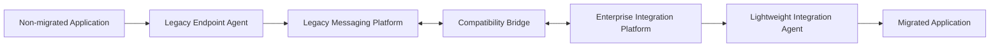
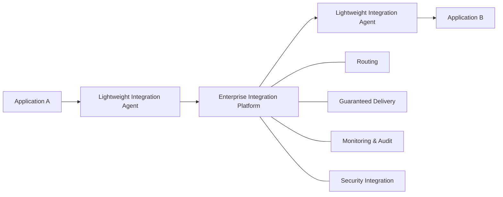
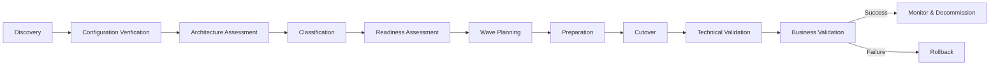

# Enterprise Integration Modernization

**Legacy Messaging Platform Migration — Architecture Case Study**

[Русская версия](README.ru.md)

> A synthetic enterprise architecture case study based on practical experience with large-scale modernization of a distributed integration landscape.

## Executive summary

A large geographically distributed enterprise has accumulated a portfolio of business-critical integrations implemented through a legacy messaging platform. The environment includes endpoint agents, regional transport nodes, centralized routing, shared transport components, different security constraints, and application owners with independent release windows.

The target is not a broker replacement. The architectural problem is to retire the legacy transport without an enterprise-wide outage, while preserving business continuity and avoiding unnecessary changes to applications.

This case demonstrates a controlled transformation approach based on:

- AS-IS, transition, and target architectures;
- incremental migration instead of a big-bang cutover;
- migration archetypes for repeatable decision-making;
- temporary coexistence of legacy and target platforms;
- migration readiness gates and wave planning;
- pilot-first validation of estimates and procedures;
- controlled cutover, validation, and rollback;
- architecture-led coordination across platform, operations, application, infrastructure, and security teams.

## My role

**Integration Architect / Technical Lead — Migration Stream**

Responsibilities represented by this case:

- architecture of the legacy integration migration stream;
- analysis and classification of existing integrations;
- definition of migration patterns and transition states;
- migration planning and sequencing;
- architecture support for cutover and rollback;
- coordination of technical participants;
- contribution to the wider target integration-platform architecture.

The wider platform architecture was a team effort. This portfolio case intentionally emphasizes the migration stream, where my responsibility was strongest.

## Architecture challenge

The legacy environment contains:

- endpoint agents installed alongside business applications;
- regional and central transport components;
- shared legacy endpoints used by multiple integrations;
- custom processing embedded in some transport configurations;
- standard and elevated security requirements;
- configurations that may differ from documentation;
- independent application maintenance windows.

The migration approach therefore has to support applications moving at different times while keeping both old and new integration paths operational when required.

## Architecture objective

Design a migration model that:

1. allows applications to migrate independently;
2. minimizes application changes where reasonable;
3. supports temporary coexistence of legacy and target platforms;
4. identifies cases requiring application remediation;
5. provides deterministic cutover and rollback procedures;
6. scales from a pilot to a repeatable migration factory.

## Architecture at a glance

### AS-IS

### Transition architecture

### Target architecture

The central design idea is that **migration is a portfolio transformation problem, not a sequence of infrastructure replacements**.

## Migration archetypes

| ID | Archetype | Use when |
|---|---|---|
| M1 | Direct Migration | Both sides can move in one change window and no legacy-specific behavior is required |
| M2 | Hybrid Coexistence | Dependent participants cannot migrate at the same time or share legacy components |
| M3 | Security-Constrained Migration | Additional identity, certificate, key-management, or security validation is required |
| M4 | Application Remediation | Legacy transport performs behavior that cannot be replaced transparently |

See [Migration Strategy](docs/migration-strategy.md) for the decision model.

## Migration lifecycle

## Complexity and readiness are different dimensions

A technically complex integration can be ready to migrate. A simple integration can be blocked by missing ownership, access, test data, or an agreed change window.

**Complexity:** LOW / MEDIUM / HIGH  
**Readiness:** READY / CONDITIONAL / BLOCKED

This separation prevents misleading single-score prioritization.

## Repository map

| Area | Content |
|---|---|
| [Context & Drivers](docs/context-and-drivers.md) | Problem statement, constraints, architecture drivers |
| [Architecture](docs/architecture.md) | AS-IS, transition and target views |
| [Migration Strategy](docs/migration-strategy.md) | Archetypes, decision tree and lifecycle |
| [Migration Factory](docs/migration-factory.md) | Portfolio assessment, readiness and wave planning |
| [Risk & Governance](docs/risk-and-governance.md) | Risk model, cutover gates, RACI |
| [Lessons Learned](docs/lessons-learned.md) | Generalized conclusions from the case |
| [Architecture Decisions](decisions/) | ADRs for key transformation decisions |
| [Synthetic Data](data/) | Fictional integration inventory and migration planning examples |
| [Governance](governance/) | Readiness checklist, risk register and responsibility model |

## Architecture decisions

- [ADR-001 — Incremental Migration over Big-Bang Replacement](decisions/ADR-001-incremental-migration.md)
- [ADR-002 — Temporary Hybrid Coexistence](decisions/ADR-002-hybrid-coexistence.md)
- [ADR-003 — Preserve Application Contracts Where Reasonable](decisions/ADR-003-preserve-application-contracts.md)
- [ADR-004 — Pilot Before Migration at Scale](decisions/ADR-004-pilot-first.md)

## Outcomes demonstrated by the case

The case illustrates how to:

- turn a heterogeneous legacy integration landscape into a classified migration portfolio;
- define explicit transition states rather than jumping directly from AS-IS to TO-BE;
- separate standard migration from application-remediation work;
- use readiness gates before scheduling production changes;
- support coexistence without making the temporary architecture permanent;
- treat rollback as part of architecture, not as an operational afterthought;
- use a pilot to validate the migration model before scaling execution.

## Disclaimer

**This repository contains only synthetic, anonymized portfolio material.**

All organizations, system names, topology, data, metrics, diagrams, examples, and operational scenarios in this repository are fictionalized and created specifically for this case study. No proprietary documentation, source code, configuration, credentials, network data, or internal operational instructions are included. The case reflects generalized architectural experience rather than reproducing any employer's implementation.
