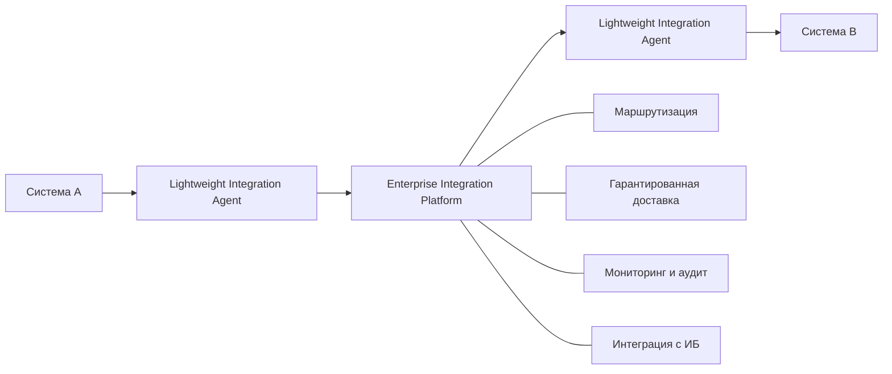
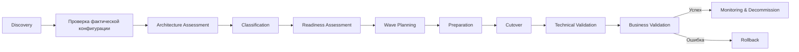

# Модернизация корпоративной интеграции

**Миграция с унаследованной транспортной платформы — архитектурный кейс**

[English version](README.md)

> Синтетический архитектурный кейс, основанный на практическом опыте масштабной модернизации распределенного интеграционного ландшафта.

## Кратко о кейсе

Крупная географически распределенная организация накопила портфель критичных интеграций, реализованных через унаследованную транспортную платформу. Ландшафт включает endpoint-агенты рядом с прикладными системами, региональные транспортные узлы, централизованную маршрутизацию, разделяемые компоненты, разные требования ИБ и независимые окна изменений у владельцев систем.

Задача — не просто заменить брокер сообщений. Архитектурная проблема состоит в том, чтобы вывести legacy-платформу из эксплуатации без единовременного отключения всех интеграций, сохранив непрерывность бизнес-процессов и минимизировав изменения прикладных систем.

Кейс показывает подход, основанный на:

- AS-IS, transition и target architecture;
- поэтапной миграции вместо big-bang cutover;
- типовых migration archetypes;
- временном сосуществовании старой и новой платформ;
- readiness gates и wave planning;
- пилоте перед масштабированием миграции;
- контролируемых cutover, validation и rollback;
- архитектурно управляемом взаимодействии платформенной команды, эксплуатации, владельцев приложений, инфраструктуры и ИБ.

## Моя роль

**Integration Architect / Technical Lead — направление миграции**

В кейсе отражены следующие зоны ответственности:

- архитектура направления миграции legacy-интеграций;
- анализ и типизация существующих взаимодействий;
- определение migration patterns и переходных состояний;
- планирование последовательности миграции;
- архитектурная поддержка cutover и rollback;
- координация технических участников;
- участие в общей архитектуре целевой интеграционной платформы.

Архитектура платформы в целом была командной работой. В этом публичном кейсе сознательно сделан акцент на направлении миграции, где моя ответственность была максимальной.

## Архитектурная задача

Исходный ландшафт содержит:

- endpoint-агенты, установленные рядом с бизнес-приложениями;
- региональные и центральные транспортные компоненты;
- общие legacy-endpoint'ы, используемые несколькими взаимодействиями;
- локальную обработку, исторически встроенную в транспортные конфигурации;
- стандартные и повышенные требования безопасности;
- фактические конфигурации, которые могут отличаться от документации;
- независимые окна сопровождения приложений.

Следовательно, миграция должна позволять системам переходить в разное время, а при необходимости — временно поддерживать одновременно старый и новый интеграционные пути.

## Цель архитектуры

Спроектировать модель миграции, которая:

1. позволяет приложениям мигрировать независимо;
2. минимизирует изменения приложений там, где это обоснованно;
3. поддерживает временное сосуществование legacy и target платформ;
4. отделяет стандартную миграцию от случаев, требующих доработки приложений;
5. задает детерминированные процедуры cutover и rollback;
6. масштабируется от пилота до повторяемой migration factory.

## Архитектура в трех состояниях

### AS-IS

### Transition Architecture

### Target Architecture

Ключевой тезис: **миграция — это задача трансформации портфеля интеграций, а не последовательная замена инфраструктурных компонентов**.

## Migration archetypes

| ID | Тип | Когда применяется |
|---|---|---|
| M1 | Direct Migration | Обе стороны можно переключить в одном окне и нет legacy-специфичной логики |
| M2 | Hybrid Coexistence | Участников нельзя мигрировать одновременно или они используют общие legacy-компоненты |
| M3 | Security-Constrained Migration | Требуются дополнительные identity/certificate/security prerequisites |
| M4 | Application Remediation | Legacy transport выполняет функции, которые нельзя прозрачно заменить |

Подробнее: [Migration Strategy](docs/migration-strategy.md).

## Migration lifecycle

## Complexity и Readiness — разные измерения

Технически сложная интеграция может быть полностью готова к миграции. Простая интеграция может быть заблокирована отсутствием владельца, доступов, тестовых данных или согласованного окна изменений.

**Complexity:** LOW / MEDIUM / HIGH  
**Readiness:** READY / CONDITIONAL / BLOCKED

Это разделение позволяет не сводить приоритизацию к одному условному баллу.

## Навигация

| Раздел | Содержание |
|---|---|
| [Context & Drivers](docs/context-and-drivers.md) | Проблема, ограничения и архитектурные драйверы |
| [Architecture](docs/architecture.md) | AS-IS, transition и target views |
| [Migration Strategy](docs/migration-strategy.md) | Archetypes, decision tree и lifecycle |
| [Migration Factory](docs/migration-factory.md) | Portfolio assessment, readiness и waves |
| [Risk & Governance](docs/risk-and-governance.md) | Риски, cutover gates, RACI |
| [Lessons Learned](docs/lessons-learned.md) | Обобщенные выводы |
| [Architecture Decisions](decisions/) | ADR по ключевым решениям |
| [Synthetic Data](data/) | Вымышленный inventory и пример планирования |
| [Governance](governance/) | Checklist, risk register и responsibility model |

## Дисклеймер

**Репозиторий содержит только синтетические и анонимизированные материалы портфолио.**

Все организации, названия систем, топология, данные, показатели, диаграммы, примеры и эксплуатационные сценарии созданы специально для этого кейса. В репозитории отсутствуют корпоративные документы, исходный код работодателя, конфигурации, учетные данные, сетевые параметры и внутренние инструкции. Кейс отражает обобщенный профессиональный опыт и не воспроизводит реализацию конкретной организации.
