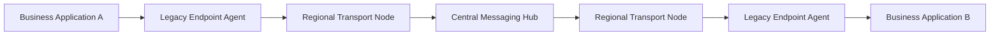
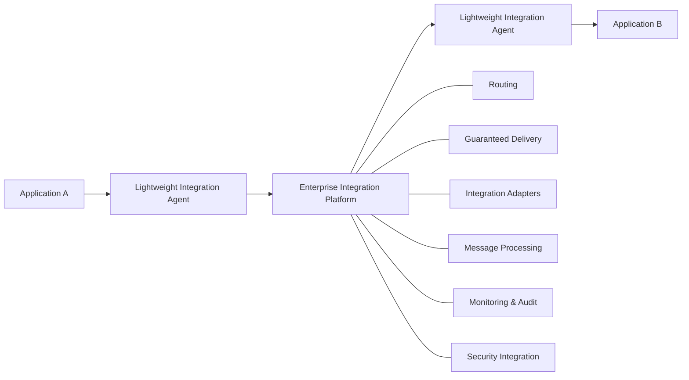
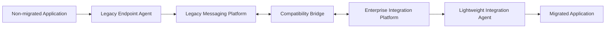
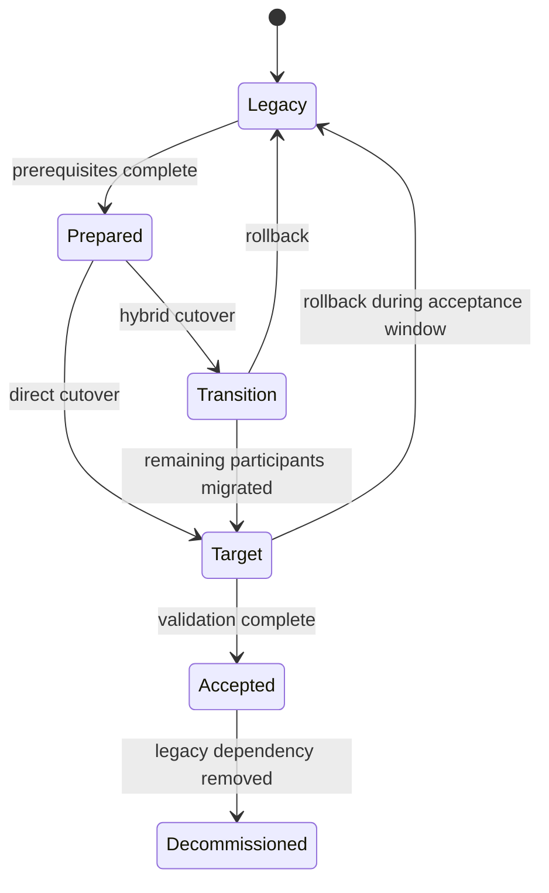
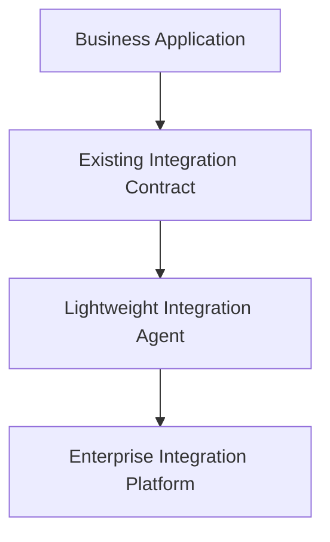
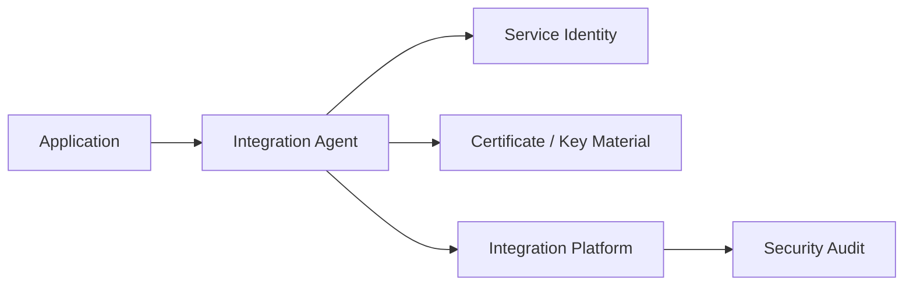

# Architecture

## 1. Architecture viewpoints

The case uses three explicit states:

1. **AS-IS** — the operational legacy transport landscape;
2. **Transition Architecture** — controlled coexistence while participants migrate independently;
3. **Target Architecture** — applications connected through the enterprise integration platform without legacy transport dependencies.

The transition state is intentionally modeled as architecture, because it can exist for months and directly affects availability, supportability, security, and change coordination.

## 2. AS-IS architecture

### Responsibilities of legacy components

| Component | Responsibility |
|---|---|
| Legacy Endpoint Agent | Local interaction with the application, file/message pickup and delivery, optional legacy-specific behavior |
| Regional Transport Node | Regional connectivity and access to the transport network |
| Central Messaging Hub | Central routing, message transfer, transport-level control |
| Application | Business processing; may implicitly depend on behavior implemented in the transport layer |

### Structural problems

- endpoint components can be shared by several integrations;
- regional topology couples application migration to infrastructure topology;
- some transport configuration contains application-specific behavior;
- documentation and deployed configuration can diverge;
- replacement of a single component can have a larger blast radius than the nominal integration scope.

## 3. Target architecture

### Target principles

- applications connect to a stable integration boundary;
- reusable transport and routing capabilities are centralized;
- endpoint agents are lightweight and do not become a second integration platform;
- integration behavior is explicit and observable;
- application-specific remediation is separated from standard transport migration;
- no new dependency on legacy compatibility mechanisms is permitted.

## 4. Transition architecture

The compatibility bridge exists only where participants cannot migrate in the same change window.

### Transition invariants

1. A message must have one authoritative active path for a given migration state.
2. Coexistence must not create duplicate business delivery.
3. The bridge must preserve the required transport semantics for the integrations assigned to it.
4. Every bridged integration must have an owner, target retirement wave, and rollback plan.
5. New integrations must use the target platform directly.
6. Temporary compatibility behavior must not leak into application contracts.

## 5. Migration state model

The model makes a distinction between *Target* and *Accepted*: reaching the target technical path is not sufficient until technical and business validation succeeds.

## 6. Application boundary

A core architecture decision is to preserve the application-facing contract where reasonable.

If preserving the existing contract would require embedding substantial legacy behavior into the new endpoint, the integration is classified as **M4 — Application Remediation** instead of contaminating the target architecture.

## 7. Security boundary

Security-specific migration prerequisites are treated as a dedicated concern rather than hidden inside a generic complexity score.

An integration cannot be READY if its required identities, access, certificates, or validation procedures are unresolved.

## 8. Decommissioning rule

Legacy infrastructure is removed only when:

- all dependent integrations have reached Accepted state;
- no rollback window requires the legacy path;
- shared dependencies have been checked;
- monitoring shows no residual traffic;
- ownership confirms decommissioning.

This prevents premature retirement of shared legacy components.
