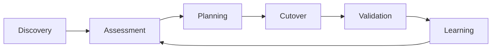

# Migration Factory

## 1. Why a migration factory

A large integration landscape cannot be migrated reliably through one-off technical decisions. The program needs a repeatable capability that turns heterogeneous legacy interactions into a controlled backlog of assessed, prepared, executed, and validated migrations.

The migration factory is therefore an architecture and delivery model, not an organizational department.



The learning loop updates classification rules, estimates, readiness checks, and runbooks after each wave.

## 2. Portfolio model

Each integration is represented by a minimum architecture record containing:

- integration identifier;
- source and target systems;
- interaction pattern;
- current transport path;
- shared dependencies;
- security profile;
- legacy-specific processing;
- complexity;
- migration archetype;
- readiness;
- proposed wave;
- owner;
- rollback feasibility.

A synthetic example is provided in [`data/integration-inventory.csv`](../data/integration-inventory.csv).

## 3. Complexity model

Complexity is an architectural property of the migration work.

### LOW

- two primary participants;
- standard transport behavior;
- no shared legacy dependency;
- no application remediation;
- ordinary volume and security profile.

### MEDIUM

One or more of:

- shared endpoint or route;
- several dependent participants;
- enhanced security prerequisites;
- non-trivial operational coordination;
- elevated volume or tighter change constraints.

### HIGH

One or more of:

- application remediation;
- significant legacy-specific processing;
- many dependent participants;
- critical shared infrastructure;
- complex coexistence;
- difficult rollback.

Complexity does **not** determine scheduling on its own.

## 4. Readiness model

Readiness answers a different question: *can this integration safely enter a production migration wave now?*

| Criterion | READY | CONDITIONAL | BLOCKED |
|---|---|---|---|
| Configuration | Verified | Partially verified | Unknown |
| Ownership | Confirmed | Delegate available | No accountable owner |
| Integration contract | Complete | Minor gaps | Missing / contradictory |
| Dependencies | Confirmed | Open questions | Unknown shared dependency |
| Infrastructure | Ready | Planned | Unavailable |
| Access & security | Ready | Pending with date | Unresolved |
| Test data | Available | Limited | Unavailable |
| Rollback | Validated / feasible | Theoretical | Not feasible |
| Change window | Agreed | Tentative | Not available |

### Status rules

**READY** — no blocking criterion remains.  
**CONDITIONAL** — migration can remain in planning but cannot pass the production readiness gate yet.  
**BLOCKED** — a material unknown or dependency prevents reliable planning or cutover.

## 5. Example portfolio matrix

```text
                    READINESS
               BLOCKED  CONDITIONAL  READY
             +---------+------------+-------+
HIGH         | remed.  | hybrid     | pilot |
COMPLEXITY   | backlog | / secure   | cand. |
             +---------+------------+-------+
MEDIUM       | owner   | dependency | wave  |
             | missing | pending    | cand. |
             +---------+------------+-------+
LOW          | access  | window     | early |
             | blocked | pending    | wave  |
             +---------+------------+-------+
```

This makes visible why a simple integration may be unschedulable while a more complex one is operationally ready.

## 6. Wave planning

The synthetic migration roadmap uses the following structure.

### Pilot

Purpose: validate the migration process, tooling assumptions, runbook, monitoring, effort estimates, and rollback model.

### Wave 1 — Independent / low-risk

Focus:

- M1 direct migrations;
- verified configuration;
- independent participants;
- simple rollback;
- limited shared dependencies.

### Wave 2 — Controlled complexity

Focus:

- M1/M3 migrations;
- security prerequisites;
- moderate coordination;
- integrations that benefit from lessons learned in Wave 1.

### Wave 3 — Hybrid / dependent

Focus:

- shared endpoints;
- M2 coexistence;
- higher-volume or business-critical interactions;
- multiple application owners.

### Wave 4 — Remediation

Focus:

- M4 application changes;
- legacy-specific behavior removal;
- integration redesign where transparent migration would damage the target architecture.

Wave names describe the dominant workload, not absolute rules. A high-complexity integration can be selected for the pilot if it is representative, well understood, and reversible.

## 7. Wave-entry gate

An integration enters a committed production wave only if:

1. its AS-IS configuration is verified;
2. dependencies are known;
3. its archetype is agreed;
4. its readiness is READY;
5. cutover and rollback owners are assigned;
6. target configuration is prepared;
7. test evidence is available;
8. change timing is approved.

## 8. Factory metrics

The case intentionally avoids fabricated business KPIs. Useful operational metrics for a migration factory would include:

- integrations assessed per period;
- percentage with verified configuration;
- READY / CONDITIONAL / BLOCKED distribution;
- migrations completed per wave;
- rollback rate;
- average lead time from discovery to READY;
- number of integrations requiring application remediation;
- number and age of temporary bridge dependencies;
- forecast vs actual engineering effort.

These metrics are useful because they measure migration-system health rather than only counting completed cutovers.

## 9. Feedback loop

After each pilot or wave, the architecture team reviews:

- which assumptions were wrong;
- which readiness checks failed to predict issues;
- whether archetype rules need adjustment;
- whether effort estimates were materially inaccurate;
- whether new shared dependencies were discovered;
- whether temporary transition components are being retired on schedule.

The resulting changes feed back into assessment rules and planning for the next wave.
