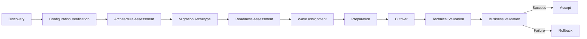
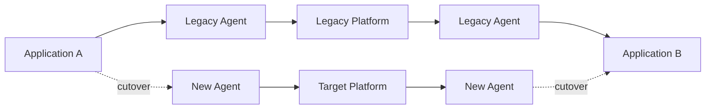
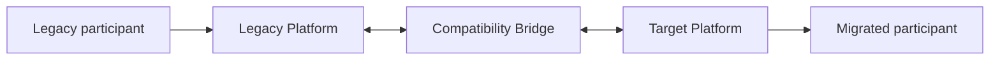
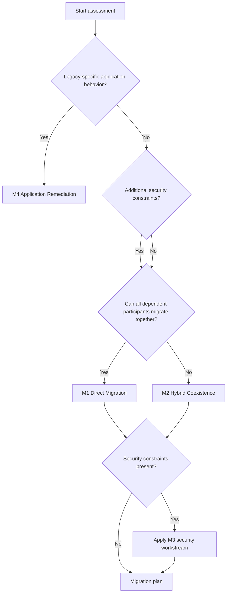
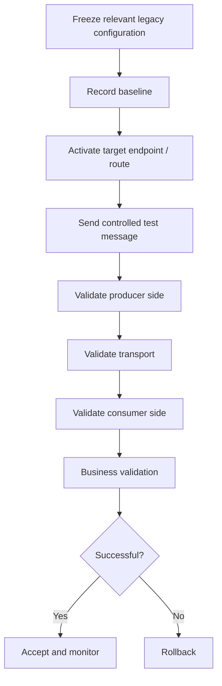
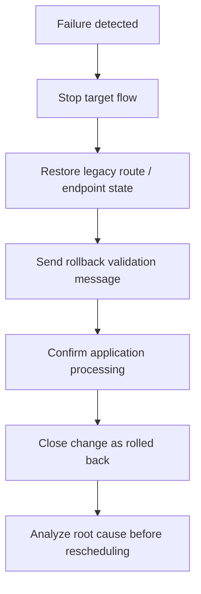

# Migration Strategy

## 1. Strategy

The migration is organized as a portfolio transformation rather than a sequence of ad-hoc component replacements.

Each integration passes through the same decision process:

## 2. Migration archetypes

### M1 — Direct Migration

Use when:

- all required participants can migrate in the same change window;
- the legacy endpoint is not shared with non-migrating interactions;
- no legacy-specific processing must be preserved;
- target connectivity and access are ready;
- rollback is straightforward.

Typical path:

### M2 — Hybrid Coexistence

Use when participants cannot move together or a legacy component is shared by integrations scheduled for different waves.

Guardrails:

- coexistence has an explicit end date or exit condition;
- no new integration is created through the bridge;
- duplicate delivery is prevented;
- ownership and monitoring are explicit;
- retirement is planned at the moment coexistence is introduced.

### M3 — Security-Constrained Migration

Use when transport migration depends on additional security prerequisites such as:

- service identity provisioning;
- certificate issuance;
- key material;
- access groups;
- additional security validation;
- audit requirements.

Security constraints do not automatically make the transport architecture complex, but they can block readiness.

### M4 — Application Remediation

Use when the legacy integration layer performs behavior that is effectively part of the application contract, for example:

- custom file detection;
- naming conventions used as routing logic;
- application-specific packaging;
- local transformation;
- non-standard acknowledgements;
- processing that should not be reproduced inside the new endpoint agent.

The target is then changed intentionally through application or integration remediation rather than by copying legacy behavior into the target platform.

## 3. Decision tree

M3 can therefore act as an additional constraint on M1 or M2 rather than always being mutually exclusive.

## 4. Cutover model

### Preconditions

Before a production cutover:

- deployed configuration has been verified;
- owners and participants are confirmed;
- dependencies are documented;
- target route is prepared;
- access and security prerequisites are complete;
- monitoring is enabled;
- representative test data is available;
- rollback procedure is agreed;
- change window is approved.

### Execution

## 5. Rollback model

Rollback is triggered when one of the pre-agreed acceptance criteria fails and cannot be corrected inside the change window.

A rollback does not count as a failed architecture. It is a designed recovery path for controlled migration.

## 6. Pilot-first strategy

The pilot validates the migration system itself, not only the target platform.

Pilot objectives:

- validate discovery artifacts;
- validate runbook completeness;
- measure actual engineering effort;
- verify access and operational dependencies;
- validate monitoring and support hand-offs;
- execute rollback at least in a controlled non-production or approved test scenario;
- refine archetype rules and estimates.

Representative pilot integrations should be understandable and reversible, but not so trivial that they fail to exercise the real migration process.

## 7. Exit criteria from migration

An integration is considered migrated only when:

- target delivery is technically validated;
- business processing is confirmed;
- monitoring is stable through the acceptance period;
- rollback window has closed;
- documentation reflects the target state;
- legacy dependencies are either removed or explicitly retained for another integration.
