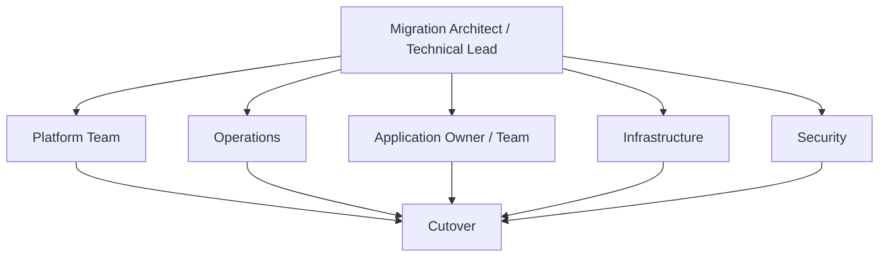

# Risk and Governance

## 1. Why governance is part of the architecture

Large-scale integration migration fails as often through unmanaged dependencies and coordination gaps as through software defects. The architecture therefore includes explicit decision rights, readiness gates, rollback ownership, and risk treatment.

## 2. Main risk classes

### Configuration risk

**Risk:** deployed configuration differs from documentation.

**Treatment:** verify the actual production configuration before classifying or scheduling an integration.

### Dependency risk

**Risk:** a legacy endpoint or route is shared by integrations outside the current migration scope.

**Treatment:** dependency analysis is mandatory before cutover; shared dependencies trigger M2 Hybrid Coexistence unless all participants can migrate together.

### Application behavior risk

**Risk:** legacy transport performs hidden application-specific processing.

**Treatment:** classify the integration as M4 and separate remediation from standard transport replacement.

### Capacity and infrastructure risk

**Risk:** target endpoint or platform prerequisites are not available when the change window starts.

**Treatment:** infrastructure readiness is a production wave gate, not an implementation task left inside the cutover window.

### Security risk

**Risk:** identities, certificates, key material, access groups, or validation procedures are incomplete.

**Treatment:** security readiness is tracked explicitly; unresolved mandatory controls block production migration.

### Organizational risk

**Risk:** application owners, operations, or local technical teams are unavailable or have conflicting priorities.

**Treatment:** accountable owners and the agreed change window are readiness criteria.

### Estimation risk

**Risk:** initial effort estimates are based on incomplete data and no prior production migration experience.

**Treatment:** use representative pilots, capture actual effort, then recalibrate subsequent waves.

### Transition-debt risk

**Risk:** compatibility mechanisms intended to be temporary become permanent.

**Treatment:** every bridge dependency has an owner, exit condition, target retirement wave, and aging metric.

## 3. Production readiness gate

An integration cannot enter a committed production change until the following are true:

- actual configuration verified;
- application owner confirmed;
- integration participants and dependencies identified;
- migration archetype agreed;
- target route and endpoint prepared;
- infrastructure available;
- security prerequisites complete;
- monitoring and diagnostics available;
- test data prepared;
- acceptance criteria agreed;
- rollback feasible and owned;
- change window approved.

See [`governance/migration-readiness-checklist.md`](../governance/migration-readiness-checklist.md).

## 4. Architecture-led delivery model

The architect does not replace the operational owners. The role is to define the technical migration model, resolve cross-system dependencies, establish architecture gates, and coordinate decisions that cross team boundaries.

## 5. High-level RACI

| Activity | Migration Architect | Platform Team | Operations | Application Owner | Infrastructure | Security |
|---|---|---|---|---|---|---|
| Discovery model | A/R | C | C | R | C | C |
| AS-IS verification | A | C | R | R | C | C |
| Migration classification | A/R | R | C | C | C | C |
| Target route design | A | R | C | C | C | C |
| Security prerequisites | C | C | C | C | C | A/R |
| Infrastructure readiness | C | C | C | C | A/R | C |
| Cutover plan | A/R | R | R | R | C | C |
| Technical validation | A | R | R | C | C | C |
| Business validation | C | C | C | A/R | C | C |
| Rollback decision | A | R | R | R | C | C |
| Legacy decommission | A | R | R | C | C | C |

Legend: **R** Responsible, **A** Accountable, **C** Consulted.

## 6. Cutover control points

### Gate G0 — Discovery complete

Evidence:

- actual endpoint configuration captured;
- route participants identified;
- current processing behavior documented.

### Gate G1 — Architecture assessed

Evidence:

- archetype assigned;
- shared dependencies identified;
- target path documented;
- application remediation isolated if required.

### Gate G2 — READY

Evidence:

- infrastructure and security prerequisites complete;
- test and rollback procedures available;
- owners and change window confirmed.

### Gate G3 — Technical cutover accepted

Evidence:

- controlled test passed;
- target message path observable;
- no duplicate or unexpected delivery;
- operational monitoring confirms stability.

### Gate G4 — Business acceptance

Evidence:

- target application processed the interaction correctly;
- accountable application owner accepts the result.

### Gate G5 — Legacy retirement

Evidence:

- acceptance window closed;
- no residual dependency or traffic exists;
- rollback no longer depends on the legacy component.

## 7. Escalation principles

Escalation is required when:

- production configuration is materially different from the assessed state;
- an unknown shared dependency is discovered;
- migration would require unplanned application behavior changes;
- rollback is no longer feasible;
- security prerequisites are incomplete;
- the planned transition would violate a target-architecture invariant.

The correct response is to stop the affected migration scope and reassess it, not to bypass the architecture gate in the change window.
